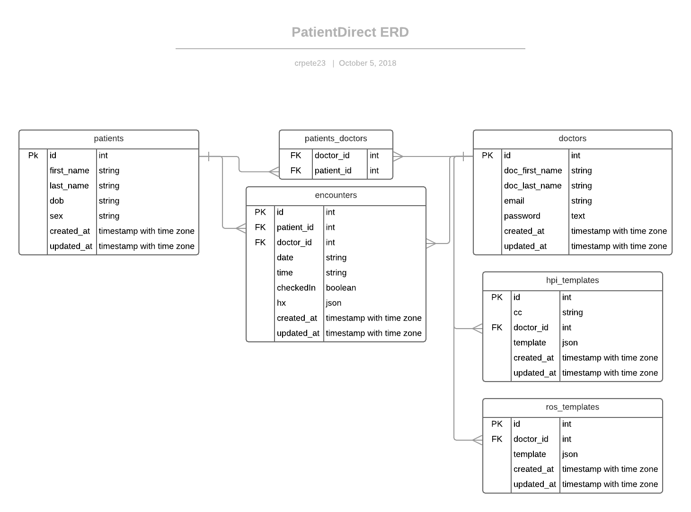

# patientDirect-backend

## About
  -patientDirect-backend is intended for handling user-provider relationship within patientDirect-frontend. Providers are able to manage templates which may be utilized to update patient encounter histories that are only able to be viewed through authorized routes.

### Description
  - DB has 6 tables.
  - Providers are allowed to signup and login
  - Providers Authorized routes include:
    - Create, Update, and Delete History of Present Illness (HPI) templates
    - Update Review of Systems (ROS) templates
    - Get Encounter/Patient information including History
  - Patients are allowed to:
    - Check in
    - Update HPI and ROS

### ERD

  

### Routes

  - Header
    - Authorization is sent as `Bearer` token
    - Content-Type: application/json

##### User routes

| Purpose | Request Type | Route | body | Authorization |
| --- | --- | --- | --- | --- |
| user signup | `post` | https://patient-direct-backend.herokuapp.com/api/users/signup |  {first_name, last_name, email, password} | - |
| user login | `post` | https://patient-direct-backend.herokuapp.com/api/users/login  | {email, password} | required |
| verify token | `get` | https://patient-direct-backend.herokuapp.com/api/users/verify  | - | required |

##### Encounter routes

| Purpose | Request Type | Route | body | Authorization |
| --- | --- | --- | --- | --- |
| get all encounters | `get` | https://patient-direct-backend.herokuapp.com/api/encounters | - | required |
| get encounters by date | `get` | https://patient-direct-backend.herokuapp.com/api/encounters/:date | - | required |
| get one encounter | `get` | https://patient-direct-backend.herokuapp.com/api/encounters/:date/:encounter_id | - | required |

##### Template routes

| Purpose | Request Type | Route | body | Authorization |
| --- | --- | --- | --- | --- |
| get CC list (cc from Hpi Templates)| `get` | https://patient-direct-backend.herokuapp.com/api/templates/:doctor_id/hpi | - | - |
| get HPI template | `get` | https://patient-direct-backend.herokuapp.com/api/templates/:doctor_id/hpi/:cc | - | - |
| get ROS template | `get` | https://patient-direct-backend.herokuapp.com/api/templates/:doctor_id/ros | - | - |
| update HPI template | `patch` | https://patient-direct-backend.herokuapp.com/api/templates/:doctor_id/hpi/:cc | { template:{} } | required |
| update ROS template | `patch` | https://patient-direct-backend.herokuapp.com/api/templates/:doctor_id/ros | { template:{} } | required |
| create Hpi template | `post` | https://patient-direct-backend.herokuapp.com/api/templates/:doctor_id/hpi | { cc, doctor_id, template:{} } | required |
| delete Hpi template | `delete` | https://patient-direct-backend.herokuapp.com/api/templates/:doctor_id/hpi/:cc | - | required |

##### Patients routes

| Purpose | Request Type | Route | body | Authorization |
| --- | --- | --- | --- | --- |
| check in | `patch` | https://patient-direct-backend.herokuapp.com/api/patients/:first_name/:last_name/:dob/:today | - | - |
| update patient history | `patch` | https://patient-direct-backend.herokuapp.com/api/patients/:patient_id/encounters/:encounter_id | { hx:{} } | - |
| get full encounter information | `get` | https://patient-direct-backend.herokuapp.com/api/patients/:patient_id/encounters/:encounter_id | - | - (will be secured) |

## Installation

1. Fork and/or Clone this repository

1. `npm install`

1. `mv .env.sample .env`

1. `createdb patient-direct-backend_dev && createdb patient-direct-backend_test`
